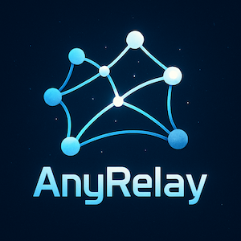

# AnyRelay

AnyRelay is a Python project to dynamically create ClashMeta/Mihomo proxy configurations containing relay nodes towards the target nodes.

[](https://deepwiki.com/YaoYinYing/AnyRelay)

>[!WARNING]
> This project is designed and developed for learning, research and security testing purposes only. It aims to provide a tool for security researchers, academics and technology enthusiasts to understand network privacy and practice communication technology.

## Purpose

AnyRelay is designed following the basic principles of privacy and security, supposing that any other proxy nodes and non-open-source facilities provided by other parties are not secure enough to meet the data transfering requirements of the user. As the results, AnyRelay is developed utilizing the traffic route mechanism and rules of ClashMeta/Mihomo, ensuring personal data being transferred only through the trustable relay nodes, yet still keeping the transfering speed as fast as possible. To achieve this goal, self-hosted or trustable relay nodes are required.

## Legality

Users must comply with local laws and regulations when downloading and using the project. Users are responsible for ensuring that their actions comply with the laws, regulations and other applicable regulations in their region.

## Basic Usage

1. Edit `data/nodes.csv`
2. Run `python scripts/regenerate_ini.py`
3. Git add, commit, and push
4. (optional) Restart the subconverter backend(e.g., docker stop & docker rm & docker run), if one needs to clear the cached files or remove logs and wishes to take this update immediately.
5. (prequisite) Go to the subconverter frontend to compose the subscription url, and add the url to the subscription urls field on Clash Meta/Mihomo clients.
6. Refresh the subscribtion urls on ClashMeta/Mihomo clients.

## Dependencies

1. A subconverter frontend that supports customized backend.
2. A subconverter backend that supports explicitly anoucement of loadbalance strategies of `loadbalance` nodes.
3. One or more relay target nodes whose names start with `RelayTarget`.
   1. Relay target can be `shadowsocks` or `socks` nodes. `shadowsocks` nodes can be used if user wants to customize the outbound proxy(wireguard, for example) in backends like Xray, yet may cause higher computation cost in encryption and decrypition processes. Instead, `socks` nodes is much simpler yet may have higher latency. I recommend creating `socks` nodes via [Dante](https://www.digitalocean.com/community/tutorials/how-to-set-up-dante-proxy-on-ubuntu-20-04).
   2. It doesn't matter whether the relay target node is blocked by the GFW.
   3. Please ensure that the relay target node ip is real or domain name is resolvable to the real IP and not behind a CDN provider.
   4. A proper static `socks` node configuration can be stored at Gist like:

      ```yml
      port: 7892
      socks-port: 7891
      allow-lan: true
      mode: rule
      log-level: info
      external-controller: ""
      proxies:
      - name: RelayTarget-0
         type: socks5
         server: <server-ip-or-domain>
         port: <port-id>
         username: <username>
         password: <password>
         tls: true
         udp: true
      proxy-groups:
      - name: Relay
         type: select
         proxies:
            - local socks5
            - REJECT
      rules: []
      ```

>[!CAUTION]
>Please remind that `socks` nodes without username/password and tls are not secure.

>[!WARNING]
>As AnyRelay is designed for self-hosted privacy control in zero trust network environment, one should not use any target node without garanteed security.

## Project Tree

1. `config`: Final ClashMeta/Mihomo proxy configurations.
   1. `relay.ini`: Relay configuration that supports `round-robin` strategy in `loadbalance` nodes.
   2. `relay_no_lb.ini`: Relay configuration that uses `url-test` instead of `loadbalance`.
   3. `nodnsleak.ini`: Non-Relay configuration that prohibit DNS leak.
2. `data`: Node data and configuration template.
3. `scripts`: Scripts to generate configuration.
4. `rules`: Specified relay/reject rules, for personal usages.

## Development Plan

1. Add support for [dialer nodes](https://wiki.metacubex.one/en/config/proxies/#dialer-proxy) as `relay` is about to be [deprecated](https://wiki.metacubex.one/en/config/proxy-groups/relay/) in future release of mihomo.

### Disclaimer

1. As the author of this project, I (hereinafter referred to as the "author") emphasize that this project should be used only for legal, ethical and educational purposes.
2. The author does not encourage, support or promote any form of illegal use of this project. If it is found that this project is used for illegal or immoral activities, the author will strongly condemn such behavior.
3. The author is not responsible for any illegal activities carried out by any person or group using this project. Any consequences arising from the use of this project by the user shall be borne by the user himself.
4. The author is not responsible for any direct or indirect damages that may arise from the use of this project.
5. By using this project, the user understands and agrees to all the terms of this disclaimer. If the user does not agree to these terms, he should stop using the project immediately.
6. The author reserves the right to update this disclaimer at any time without prior notice. The latest version of the disclaimer will be published on the project's GitHub page.
